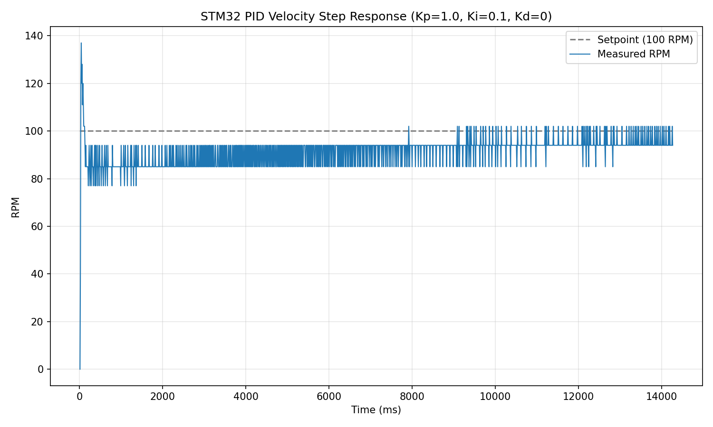
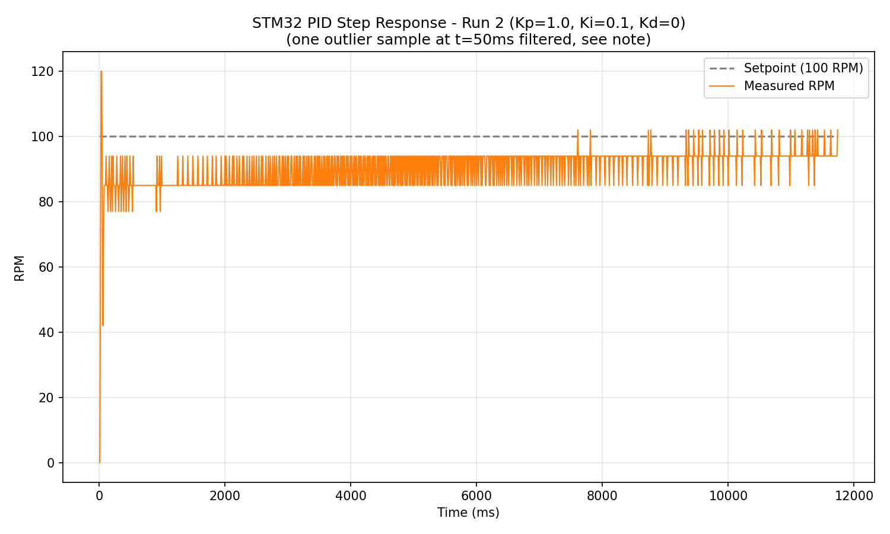

# STM32 Bare-Metal PID Velocity Controller

A register-level (no HAL) closed-loop PID velocity controller for a DC gear motor with quadrature encoder feedback, implemented in Embedded C on the STM32F446RE (Nucleo-64).

## Overview

This project implements a complete motor control pipeline from scratch at the register level:
- UART communication for real-time telemetry
- PWM motor drive via an L298N H-bridge
- Quadrature encoder decoding using hardware timer encoder mode
- A discrete PID velocity controller running on a fixed 10ms control loop (via SysTick)

No HAL or vendor abstraction libraries were used — all peripherals (GPIO, USART2, TIM1, TIM2, SysTick) are configured by direct register manipulation.

## Hardware

| Component | Part |
|---|---|
| MCU | STM32F446RE (Nucleo-64) |
| Motor driver | L298N dual H-bridge |
| Motor | GB37Y3530-12V-251R DC gear motor w/ quadrature encoder (43.7:1 gear ratio, ~700 CPR on output shaft) |
| Power | Benchtop PSU, 12V to motor driver |

## Wiring

| Signal | Nucleo Pin | Connects to |
|---|---|---|
| UART TX | PA2 | ST-LINK virtual COM (USB) |
| UART RX | PA3 | ST-LINK virtual COM (USB) |
| PWM out | PA8 (TIM1_CH1) | L298N ENA |
| Motor direction | PB4, PB5 | L298N IN1, IN2 |
| Encoder channel A | PA0 (TIM2_CH1) | Motor encoder A |
| Encoder channel B | PA1 (TIM2_CH2) | Motor encoder B |

Nucleo and L298N share a common ground with the benchtop PSU.

## Control Loop

- **Loop rate:** 100Hz (10ms period), driven by SysTick
- **Encoder decoding:** TIM2 hardware encoder mode (counts on both edges of A and B)
- **PID gains:** Kp = 1.0, Ki = 0.1, Kd = 0 (tuned manually via step response observation)
- **Output:** PWM duty cycle (0-100%) on TIM1_CH1, clamped with integral anti-windup

## Results

Two independent step-response tests were run, target setpoint = 100 RPM:

| Metric | Run 1 | Run 2 |
|---|---|---|
| Rise time (to 90 RPM) | 30 ms | 30 ms |
| Steady-state mean | 94.0 RPM | 93.1 RPM |
| Steady-state std dev | 3.75 RPM | 3.85 RPM |
| Steady-state error | 5.96% | 6.94% |
| Max overshoot | 37%* | 20% |

*Run 1's overshoot figure includes the initial transient spike before the loop stabilizes.




**Repeatability:** rise time was identical across both independent runs (30ms), and steady-state mean RPM differed by less than 1%, indicating consistent, repeatable closed-loop behavior rather than a single favorable run.

**Note on data quality:** Run 2 contains one spurious sample (1482 RPM at t=50ms) consistent with a single-cycle encoder/timer read glitch during the initial PWM ramp-up. This sample was excluded from the statistics above; it does not reflect a sustained fault and does not recur elsewhere in either dataset.

**Steady-state oscillation:** both runs show the actual RPM bouncing between two discrete values (e.g. 85/94 RPM) rather than settling on a single number. This is expected quantization behavior given the encoder's resolution (~700 counts/rev) combined with the 10ms sampling window — at this sample rate, RPM can only be computed in discrete steps, not a smooth continuum.

## What I'd improve next

- Add a derivative (Kd) term to reduce the initial overshoot during the transient
- Increase the control loop sample window (e.g. 50ms) to reduce RPM quantization noise, at the cost of slower response
- Cross-validate this velocity controller's step response against the [C++ trapezoidal motion simulator](https://github.com/nurislamabd/cpp-motor-simulator) — note this would require matching control objectives (the simulator models a trapezoidal *position* profile, this project is a *velocity* PID controller), so a fair comparison needs equivalent test conditions, not a direct overlay of existing data
- Configure the PLL for a higher core clock (currently running on the default 16MHz HSI) to allow finer PWM resolution and faster control loop rates

## Repository structure

```
.
├── Src/
│   ├── main.c               # Full bare-metal implementation (UART, PWM, encoder, SysTick, PID)
│   ├── syscalls.c
│   └── sysmem.c
├── Startup/
│   └── startup_stm32f446retx.s
├── Inc/
├── data/
│   ├── step_response.csv
│   └── step_response_run2.csv
├── plots/
│   ├── step_response_full.png
│   └── step_response_run2_full.png
├── STM32F446RETX_FLASH.ld
├── STM32F446RETX_RAM.ld
└── README.md
```

## Build & Flash

1. Open the project in STM32CubeIDE
2. Build (Ctrl+B)
3. Connect Nucleo-F446RE via USB, flash (Run / F11)
4. Open a serial terminal at 115200 baud on the ST-LINK virtual COM port to view live RPM/duty telemetry
